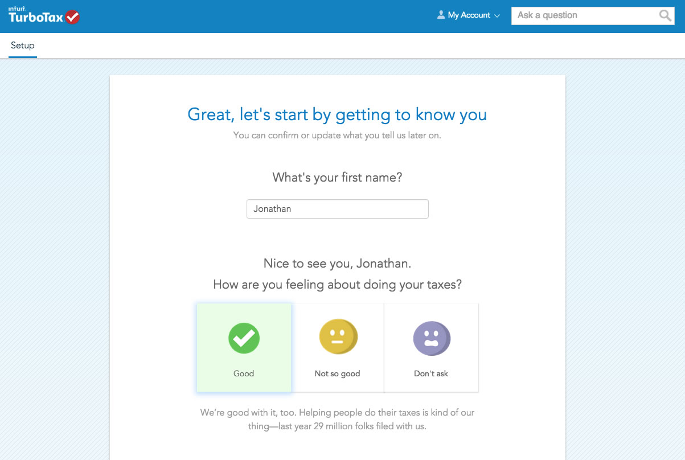

### Go Back

- [Welcome & Setup](../)

# What is Front End Engineering?

The **Front End** is the part of the application that users see, touch, and interact with.

## Goals

- Identify the key differences between Front End and Back End engineering
- Categorize various technologies used in Front End engineering

## What is Front End?

When we're talking about web development, the Front End is the part of the code base that takes care of rendering the user interface in the web browser.

Over the last decade, the web has evolved from a platform that served static web pages with content to a platform that provides rich, interactive experiences to users.

## What Makes Front End Engineering Interesting + Challenging?

### It Presents Logical Challenges

See the Pen <a href="http://codepen.io/dissimulate/pen/eZxEBO/">Tearable Cloth v2</a> by dissimulate (<a href="http://codepen.io/dissimulate">@dissimulate</a>) on <a href="http://codepen.io">CodePen</a>.

### It Can Guide a User Through a Complicated Task

<a href="https://www.appcues.com/blog/how-turbotax-makes-a-dreadful-user-experience-a-delightful-one" target="blank">Here's</a> a great blog post about how Turbo Tax makes a complicated, intimidating task relatively simple, and even fun.

### Or Help Us Understand a Complicated Subject

Big numbers are difficult to imagine. How can you imagine a billion? Even a thousand things collectively is a challenge. The recent news and precautions around COVID-19 is all a lot to take in and understand. Visualizations like this help people understand the role that social distancing can play in reducing the impact of the virus.

<a target="blank" href="https://www.washingtonpost.com/graphics/2020/world/corona-simulator/">See the project</a>.

### It Allows You, As a Developer, to Tell a Story

Check out <a href="http://www.sbs.com.au/theboat/" target="blank">The Boat</a> - an interactive graphic novel about the Vietnam War using CSS/JS/Parallax.

## No Matter Your Passion, You're Needed in Front End

While many people become developers because it can provide a stable career and lifestyle, it can also allow you to contribute towards something you are passionate about! Whether that be problems solving, exposing important data, or helping people do daily tasks, or anything in between, Front End developers play an essential role.
 

## You Don't Have to Be a Designer

Front End developers often work with designers, who provide detailed comps like the one above. These comps allow a Front End developer to focus on managing the complicated interactions of the site.

There's a common misconception that the Front End is only about colors, fonts, and having a good eye. However, this type of development is more focused on making data useful, accessible, and interactive. The code we write in JavaScript and other frameworks does a lot of heavy logical lifting.

## What Technologies are used on the Front End?

The Front End of the web is based on three major technologies:

<section class="data-type-cards language-cards">
  

    <h3>HTML</h3>
    
HTML holds the content we see on a page (text, images, etc.) and defines the structure and order in which the content appears.

    
  

  

    <h3>CSS</h3>
    
CSS defines the look and feel of a webpage - it can change the layout of items on a page, colors, fonts, and even animate elements!

    
  

  

    <h3>JavaScript</h3>
    
JavaScript is what lets the user interact with a page. For example, clicking a button and getting some sort of response.

    
  

</section>

Many libraries and frameworks have been built _on top_ of JavaScript that make Front End development even more robust and powerful! If you hear terms like React, Vue, Ember, Angular... those are all JavaScript frameworks used to build professional level applications.

## What are we doing today?

We're going to dive into the three technologies used on the frontend:

1. Discover the underlying structure of web pages with HTML.
1. Learn about some of the possibilities with CSS.
1. Use JavaScript to access HTML elements that appear in the browser.
1. Listen and respond to user interactions such as _clicks_ and _mouseovers_.

 

### Up Next

- [HTML Introduction](../html-intro)
- [Introduction to CSS](../intro-to-css)
- [JavaScript Fundamentals](../js-1)
- [Connecting HTML & JavaScript](../js-2)
- [Building Dynamic User Experiences](../js-3)
- [Extensions](../extensions)
- [Wrap-Up](../wrap-up)
