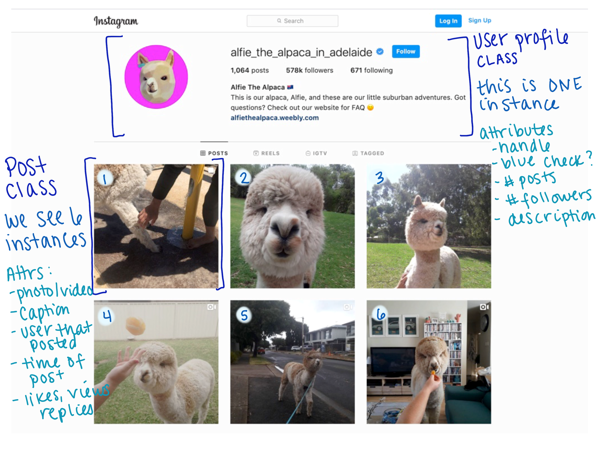

### Go Back

- [Welcome and Introductions](../)
- [What is Back End Engineering?](../what-is-bee)
- [Ruby Introduction](../ruby-intro)
- [Ruby Methods](../ruby-methods)
- [Control Flow](../control-flow)
- [Loops](../loops)

# Connecting to Real-World Scenarios

A lot of programming is concerned with the management of data for an application. There are different ways we can structure the data itself as well as the systems that manage it. Object-Oriented Programming (OOP) is one way to design a program to manage data.

Object-Oriented Programming (OOP) is a paradigm for how we can organize code. Without seeing examples, that definition just feels… unhelpful. In this section, we won’t dig into code quite yet, but we’ll do some thinking and list-making to set ourselves up to write code in the next section!

OOP is not exclusive to Ruby! In fact, many of the most widely used programming languages follow the patterns of OOP, including C#, Java and Python.

<section class="data-type-cards language-cards">
  

    <h3>Ruby</h3>
    
Ruby is the programming lanugage we are using today, to give instructions to the computer. It's known to be a beginner friendly language because of it's syntax and similarities to the English language!

  

  

    <h3>OOP</h3>
    
Object-Oriented Programming (OOP) is a programming paradigm that we can use with many lanuages, including Ruby and C#. It focuses on writing reusable code.

  

</section>
  

## Car Factory

Let's think about some components of a Ford car factory. We may make some stuff up, but this analogy should help us build context for what OOP is.
- The factory has a machine that is designed to make a Ford Escape
- All Escapes have four wheels and four doors
- The color, interior fabric and engine size can vary from one Escape to another

With the information above, in theory, the manager at the factory should be able to say "please make a blue Escape with a leather interior and 2.5 cylinder engine", and that should be possible.

That example about the car factory ties directly to concepts of OOP. We will use three main technical terms today. They are below, with the connection to the car factory example:
- **`class`** - A class is like a blueprint or template. The factory machines are designed to make a car - that is the template for ALL Escapes. We could probably name it the _EscapeCar_ class.
- **`object/instance`** - An instance is an object that is made from the class template. The blue Escape that the manager requested (and was able to physically sit in and drive) is referred to as an object or instance of the _EscapeCar_ class.
- **`attribute`** - An attribute is a specific characteristic about an instance that has the potential of varying from other instances. With our Escapes, _color_, _interior_ and _engine_ would be attributes, because they weren't programmed into the template, but were extra information the manager was able to give for each specific instance of that class.

  <h2>Classes and Objects - At Home!</h2>
  
Pick an object that you see sitting around in your home. It could be a candle, water bottle, glove, anything!
  
  
Jot down the following, and be ready to share out with the group:

  <ul>
    <li>What <em>type</em> of object is it? What might the class name be?</li>
    <li>Are there multiple objects/instances of it in your home, or in the world? List a few.</li>
    <li>What are some of its attributes?</li>
  </ul>

# How to CODE these concepts

We've talked at a high level about classes, instances and attributes, and you may be starting to wonder what this will look like in code. That's what we'll do next!

  <h2>Explore Class Syntax</h2>
  
While this may feel uncomfortable at first, research shows this is one of the most effective ways to learn. Instead of your instructor typing code and explaining every character, you are going to read some Ruby code that's already been written. You will likely have some questions about what X or Y is doing, and you'll also likely be able to make some deductions about what other pieces are doing. We will talk through it all after you've had a chance to use your brain and make some connections on your own.
  
  
Look at the <a target="blank" href="https://repl.it/@turingschool/oop-intro-ford-escape#main.rb">code in this repl.it</a> and think through the guiding questions:

  <ul>
    <li>What is the name of the class?</li>
    <li>How many instances are being made?</li>
    <li>What is the attribute?</li>
    <li>Can you make another instance?</li>
  </ul>

As a group, let's discuss what you probably found and maybe had questions about.

## Connection to Apps we Use

Now that you've seen how this "factory" concept can be used in code, you may be wondering about how this code concept is used within apps we use every day.

We won't get all the way there in illustrating it today, but, we can look at Instagram for a moment to talk through where we see some use of classes and instances.

### Up Next

- [Being a Turing Student](../turing-info)
- [Wrap Up and Next Steps](../turing-info/next-steps)
